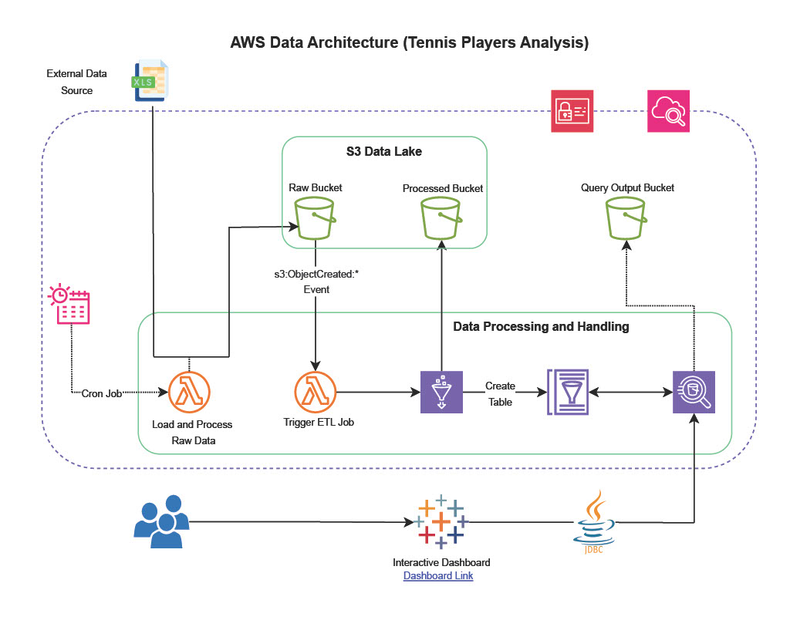

# AWS Tennis Analysis Data Pipeline Project

## Introduction

In this project, I built an automated ETL pipeline to extract, transform, and load tennis data from the web, process it using AWS services, and visualize it with Tableau. The goal was to create a robust, scalable, and efficient data pipeline that can handle regular updates and provide actionable insights through interactive dashboards. 

## Data Architecture Diagram

## Step-by-Step Implementation

### 1. Data Extraction with AWS Lambda

**Objective**: Automate the extraction of raw data from [tennis-data.co.uk](http://tennis-data.co.uk/) and store it in an S3 bucket.

- **Why Lambda?** AWS Lambda allows for serverless execution of code, which means no need to manage infrastructure. It's cost-effective and scales automatically with demand.
- **EventBridge Scheduler**: I used Amazon EventBridge to schedule the Lambda function to run every week. This ensures regular updates of the raw data without manual intervention.

### 2. Storing Raw Data in S3

**Objective**: Store the raw data in an S3 bucket for further processing.

- **S3 Bucket**: Chose S3 due to its scalability, durability, and integration with other AWS services. It serves as a reliable storage solution for both raw and processed data.

### 3. Triggering ETL with S3 Event Notifications

**Objective**: Automatically trigger the ETL process when new data arrives in the raw S3 bucket.

- **S3 Event Notifications**: Configured S3 to send notifications to another Lambda function whenever a new object is created in the raw data bucket. This Lambda function then triggers the Glue ETL job.

### 4. Data Transformation with AWS Glue

**Objective**: Transform raw CSV data into a structured format and store it in a processed S3 bucket as Parquet files.

- **AWS Glue**: Selected AWS Glue for its serverless ETL capabilities. It automatically handles provisioning, managing the ETL jobs, and scaling as needed.
- **Glue Crawler**: Used Glue Crawler to create a data catalog for the raw data, making it easier to query and transform.
- **Custom Transformations**: Implemented custom transformations in Glue to clean and preprocess the data, such as replacing -1 values with 0 for better visualization.

### 5. Storing Processed Data in S3

**Objective**: Store the processed data in an S3 bucket in Parquet format.

- **Parquet Format**: Chose Parquet due to its efficient storage and query performance. It significantly reduces the storage cost and improves the speed of data queries.
- **Overwrite Existing Data**: Ensured that each ETL run replaces the old data to avoid duplication and keep the dataset up-to-date.

### 6. Querying Data with AWS Athena

**Objective**: Enable querying of the processed data using AWS Athena.

- **AWS Athena**: Selected Athena for its ability to run SQL queries directly on data stored in S3. It provides an easy and cost-effective way to analyze large datasets without the need for complex ETL pipelines.

### 7. Visualizing Data with Tableau

**Objective**: Create interactive dashboards to visualize the processed data.

- **Tableau Integration**: Connected AWS Athena with Tableau using the JDBC driver. This integration allows for dynamic visualizations and interactive dashboards that update with new data.
- **Interactive Dashboards**: Designed dashboards that display various statistics, charts, and heatmaps, providing deep insights into tennis player performance.

## Best Practices and Decisions

### Serverless Architecture

**Why Serverless?** Using AWS Lambda and Glue for serverless processing ensures that the infrastructure scales automatically with demand and reduces the need for manual management, leading to lower costs and higher efficiency.

### Data Storage and Format

**S3 for Storage**: S3's durability and integration with other AWS services make it an ideal choice for storing both raw and processed data.

**Parquet Format**: Using Parquet format for processed data improves query performance and reduces storage costs, making it a practical choice for large datasets.

### Automation and Scheduling

**EventBridge Scheduler**: Automating the data extraction process using EventBridge ensures regular updates without manual intervention, maintaining the pipeline's efficiency.

**S3 Event Notifications**: Triggering the ETL process with S3 event notifications creates a seamless workflow, where each component interacts automatically based on predefined events.

### Data Cleaning and Transformation

**Custom Transformations**: Implementing custom transformations in AWS Glue allows for specific data cleaning and preprocessing steps, ensuring the data is in the best format for analysis and visualization.

### Data Catalog and Querying

**Glue Crawler and Athena**: Using Glue Crawler to create a data catalog and Athena for querying provides a powerful combination for managing and analyzing data efficiently.

### Visualization

**Tableau**: Integrating Tableau with AWS services enables the creation of interactive and dynamic dashboards, providing actionable insights and a user-friendly interface for data exploration.

## Conclusion

This project showcases the power of AWS services in building a robust and scalable data pipeline. By leveraging serverless architecture, automated scheduling, efficient data storage, and powerful visualization tools, I created a comprehensive solution for extracting, transforming, and analyzing tennis data. The decisions made throughout the project follow best practices, ensuring an efficient, cost-effective, and maintainable pipeline.

Feel free to reach out if you have any questions or would like to discuss the project in more detail!
